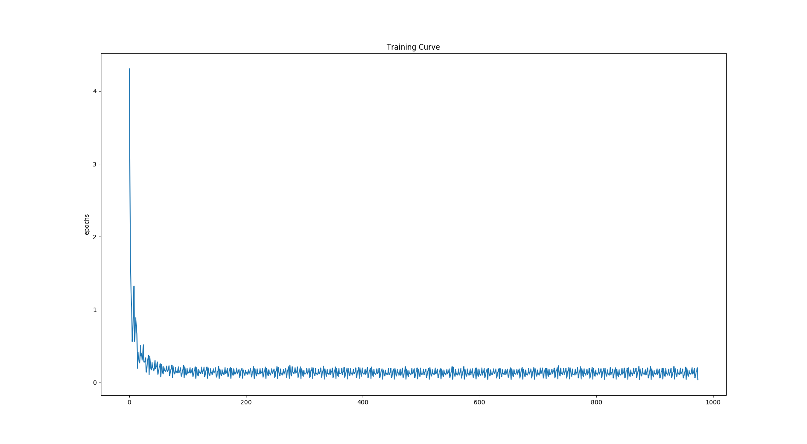

We assume that the dynamics of the pendulum system are unknown and the goal is to compute a sequence of actions that ensure the pendulum can stay in an upright position.
We first the learn the model of the system by random exploration. Then using the learned model, use a planner to compute the sequence of states required to achieve the desired position.

model_collect_dataset.py:
* collects dataset by randomly sampling actions and then performing those actions and recording observations
* splits (80:20) for training and testing 
* outputs train.npy and test.npy

model_learn.py:
* learns the model using the observations and actions - Basically gets the state transition probability distribution
* Network: 2 FC layer network with ReLU activation in between
* Loss: MSE
* Optimizer: Adam
* training curve: 
* learned model is saved in pendulum_model.pt

planner_astar.py:
* plans a path from the default rest position 0 degrees to the upright 180degree position. 
* Uses the pendulum_model.pt to get the state transitions between states and 
* Discretizes continuous state space and action space

